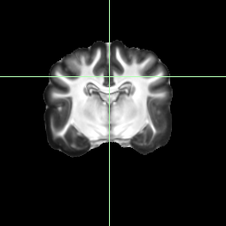
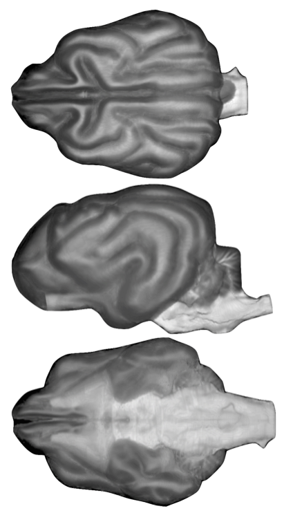

# Datta_2012_PLosOne

:-------------------------:|:-------------------------:
!   |  
!  |  !

  

A digital atlas of the canine brain

  * R Datta, J Lee, J Duda, BB Avants, CH Vite, B Tseng, JC Gee, GD Aguirre, GK Aguirre. (2012) [A digital atlas of the dog brain](https://journals.plos.org/plosone/article?id=10.1371/journal.pone.0052140). PLoS ONE 7(12): e52140

The atlas is comprised of both low resolution (1 mm isotropic) and high resolution (0.33 mm isotropic) templates of the canine brain, as well as cortical surface representations suitable for use in FreeSurfer.

The atlas is free to use (with appropriate attribution) for academic or commercial purposes. The atlas may not be distributed for commercial gain.

## Template files

 * InVivoTemplate -- A diffeomorphic average of 7, in-vivo canine brains, at 1 mm resolution, including entire head and skull-striped versions
 * ExvivoTemplate -- A diffeomorphic average of 8, ex-vivo canine brains, at 0.33 mm resolution, warped to the in-vivo space
 * SurfaceTemplate -- Cortical surface representations derived from the high-resolution, ex-vivo atlas, for use in FreeSurfer

## A limitation: gray matter layer

While a white matter segmentation is included in the atlas and is the basis of a surface reconstruction, we have been unable to produce a gray-matter surface. Our images have a image intensity boundary at the outer surface of the gray matter that is unlike in-vivo specimens. Consequently, the FreeSurfer algorithms for growing a gray-matter layer atop the white matter volume do not perform properly. 
